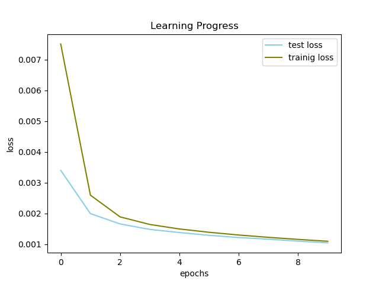

# ROS_Application

## Inhaltsverzeichnis
* [Kurzübersicht](#Kurzübersicht)

* [Konzept artifizieller neuronaler Netze](#Konzept-artifizieller-neuronaler-Netze) 

* [Robot Operating System](#Robot-Operating-System-(ROS)) 

  * [Überblick zu ROS](#Überblick-zu-ROS) 

  * [Komponenten- und Aufgabenbeschreibung](#Komponenten%--und-Aufgabenbeschreibung)

  * [Komponenten- und Aufgabenbeschreibung](#Komponenten%--und-Aufgabenbeschreibung)

  * [Benutzungsanweisung und benötigte Plugins](#Benutzungsanweisung-und-benötigte-Plugins)

      * [Installation](#Installation-(Ubuntu))
  
      * [Programm ausführen](#Programm-ausführen)

* [Auswertung](#Auswertung)

  * [Experiment 1](#Experiment-1) 

  * [Experiment 2](#Experiment-2)

  * [Experiment 3](#Experiment-3)

* [Fazit](#Fazit)

---

## Kurzübersicht

Ziel dieses Projektes war die Implementierung eines neuronalen Netzwerkes innerhalb einer ROS Umgebung, das in der Lage sein soll, eine Vorhersage darüber zu machen, welchen Wert eine handgeschriebene Ziffern von [0, 9] repräsentieren soll. Die verwendeten Bilddaten liegen der Einfachheit halber im PNG-Format vor, die Implementierung ließe jedoch mit geringfügigen Änderungen auch das Verarbeiten von Video-Streams zu diesem Zwecke zu. Das Programm wurde in Python 3 geschrieben.

---

## Konzept artifizieller neuronaler Netze

Artifizielle Neuronale Netzwerke entlehnen die Idee ihres Aufbaus der Neuroanatomie.
Analog zum biologischen Vorbild, werden durch die Verschaltung vieler kleiner Funktionseinheiten (Neurone) komplexe Netze gewoben. Dies geschiet im Kontext des maschinellen Lernens in Schichten ('Layer').
Diese artifiziellen neuronalen Netze (anN) lassen sich - entsprechendes Training vorausgesetzt - vielseitig, beispielsweise im Bereich der Mustererkennung und somit zur Klassifikation, einsetzen. 

Die Wahl der Architektur hängt dabei von der zugrunde liegenden Aufgabe und dem Format der erhobenen Daten ab. (So eignen sich manche anN besser für die Unterscheidung von Bildern als zur Klassifikation akustischer Signale oder der Verarbeitung schriftlicher Sprache.) 

Das Ziel beim Traininern solcher anN ist, das Netz möglichst davon abzuhalten, die Daten die es zu klassifzieren gilt, "auswendig" zu lernen (sog. 'overfitting'), sondern seine internen Gewichtungen der Erkennungsmerkmale möglichst zu generalisieren. Metaphorisch gesprochen, soll das anN das Konzept oder die grundlegende Idee einer/mehrerer Klasse/n lernen um, wenn es mit Daten konfrontiert wird, welche nicht in den Trainingsprozess einflossen, unbekannte Daten verarbeiten zu können. 

Ein Modell (alternative Bezeichnung für ein anN), dass es nicht schafft aufgrund der gegebenen Merkmale/Daten eine hinreichend zufriedenstellende Klassifikation vorzunehmen leidet am sogenannten 'underfitting'. 

Das Lernen findet beim sogenannten 'supervised learning' (jener Methode welche in diesem Projekt zum Einsatz kam) wie folgt statt:

Zunächst wird ein anN angelegt und die Gewichtungen seiner Verbindungen zufällig initialisiert. Wir haben uns hier für die 'Fully Connected Feed Forward' - Architektur entschieden. Bei welcher - der Name lässt es bereits erahnen - jedes Neuron eine Verbindung zu jedem Neuron der nachfolgenden und vorhergehenden Schicht hat (eine Ausnahme bilden hierbei natürlich die erste und die letzte).

Weiterhin benötigt man Traningsdaten in Form von einem Inputformat (Bild/Ton/Schrift ect.) und einem, diesem Trainingsbeispiel ('sample') korrekt zugeordneten, Label (eben jenen Wert, den das anN vorhersagen soll).

Für dieses Projekt verwandten wir den MNIST Datensatz - eine Sammlung von über 70.000 Bildern handgeschriebener Ziffern, welchen ihr wahrer Wert bereits zugeordnet wurde.

Die Ausgangsmenge dieser Daten wird vor dem Trainieren des Modells in mehrere Teile separiert.
Üblich ist die Aufteilung in Trainings- und Testdatensatz - wobei über das genaue Verhältnis diverse Meinungen existieren - grundsätzlich sollten jedoch deutlich mehr Trainings- als Testdaten verwendet werden um effektives Lernen zu garantieren. 

Unsere Aufteilung liegt bei ca. 60.000 Trainingsbeispielen zu 10.000 Testdaten.

Unser Modell geht nun wie folgt vor: 

Die Trainingsdaten - die in diesem Fall als schwarz-weiß-Bilder vorliegen - werden dem Netzwerk "häppchenweise" (in sog. '(Mini-)Batches') übergeben. 

Jedem der 784 (28*28) Pixel eines samples ist ein Helligkeitswert zugeordnet - diese repräsentieren (im Unterschied zur Biologie in welcher Neurone entweder aktiv sind oder nicht) den Aktivierungsgrad [zwischen 0.0 und 1.0] der Neurone der ersten Schicht unseres anN. Aufgabe des Netzes ist es nun herauszufinden, welche Kombinationen von Helligkeitswert in Verbindung mit ihrer Position (die Position aller anderen Aktivierungswerte der anderen Pixel berücksichtigend) merkmalsgebend für die Zugehörigkeit zu einer Klasse sind.

Je mehr Trainingsdaten zur Verfügung stehen und je variantenreicher die einzelnen Klassen dargestellt sind, desto größer ist die Aussicht auf Erfolg hinsichtlich der Generalisierungsfähigkeit des anN.

Nachdem ein sample das anN durchlaufen hat, gibt das Modell eine Vorhersage (in Form von Wahrscheinlichkeitswerten für die Zugehörigkeit zu allen Klassen zwischen denen es eine Wahl zu treffen gilt) ab.

Aus der Summe der quadratischen Abweichung eben jener Zugehörigkeitswahrscheinlichkeiten und dem wahren Wert der vorhergesagt werden soll, lässt sich abschätzen wie gut das Modell performt. Dieser Wert ist das Ergebnis der Kostenfunktion.

Das eigentliche maschinelle "Lernen" erfolgt nun durch wiederholtes Anwendung von 'Backpropagation' - einem Verfahren um resourcensparend den invertierten Gradienten der Kostenfunktion zu berechnen bzw. zu approximieren (siehe 'stochastic gradient descent', bei dem Verfahren werden nur Teile der Trainingsdaten zur Annäherung an den Gradienten genutzt) und so herauszufinden, wie das Modell intern seine Gewichtungen anpassen muss, um noch genauere Vorhersagen zu treffen. Zusammenfassend kann man das Training eines Modells als ein Minimierungsproblem der Kostenfunktion auffassen.

Interessanterweise hat man zwar durch die Auswahl der Architektur, die Auswahl und Vorverarbeitung der Trainingsdaten sowie die Lern- und Testparameter Einfluss auf die Performance des Netzes; doch was genau das Netz als Merkmalsträger einer Klasse identifiziert, bleibt dem Modell selbst überlassen - gerade deswegen ist es wichtig eine sorgfältige Auswahl zu bei der Wahl der Trainingsdaten zu treffen.

---

# Robot Operating System (ROS)

## Überblick zu ROS

Das 'Robot Operating System' besteht aus einer open source Sammlung von Software-Bibliotheken und Werkzeugen (Treiber, Algorithmen, Entwickler_innen-Tools), welche für die Erstellung von roboterbezogenen Anwendungen genutzt werden können.

ROS setzt dabei auf eine Peer-to-Peer Architektur - das bedeutet in diesem Kontext, dass die einzelnen, nur für eine Aufgabe ausgelegten Programmbausteine (Nodes) über eine vordefinierte Programmierschnittstelle (application programming interface, oder kurz API) miteinander kommunizieren können und das sogar über mehrere Computer hinweg.

Dafür nutzen die Nodes sogenannte 'Topic' und können entweder als 'publisher' oder 'subscriber' - also als Sender oder Empfänger - einer Nachricht ('message') konfiguriert werden. Es besteht weiterhin die Möglichkeit, mehrere topics zu sogenannten 'actions' zusammenzufassen und dadurch weitere Kontrollmöglichkeiten zu gewinnen (bspw. das Abbrechen einer Aufgabe oder das Einsehen des Fortschrittsgrades).

Die eben erwähnten Messages stellen die Datenstruktur dar, welche festlegen von welchem Typ ein topic ist. Eine Nachricht kann aus verschiedenen Datentypen zusammengesetzt werden. 

Ganz ähnlich zu den Messages können Nodes auch über 'services' miteinander kommunizieren. Ein Service stellt dabei eine eigene Instanz innerhalb der ROS-Architektur dar und nimmt Anfragen von Nodes entgegen und leitet diese an die entsprechende Nodes weiter.

---

## Komponenten- und Aufgabenbeschreibung

Unsere Implementierung besteht aus vier Nodes:

  - Cam

  - Processor
  
  - Controller
  
  - AI-Server (Service)


Der *Cam-Node* hat die Aufgabe die Inputdaten bereitzustellen. In unserem Fall simuliert der Node dies durch eine randomisierte Auswahl von Bildern der Ziffern [0, 9]. Das ausgewählte Bild wird dann an den Processor-Node weitergeleitet. Das Label - also der Zahlenwert, welchen wir zu identifizieren hoffen, sendet der Cam-Node direkt an den Controller-Node.

Der *Processor-Node* nimmt das Bild des Cam-Nodes entgegen und nimmt eine Reduzierung der Inputdimension des eingehenden Bildes vor. Für das menschliche Auge ist das Bild bereits in Schwarz&Weiß gehalten, jedoch besteht das PNG aus drei (RGB-)Farbkanälen. Nach dieser Vorverarbeitung ist jedem Teil des Bildes lediglich ein einzelner Wert zugeordnet - nämlich der Heligkeitswert des entsprechenden Pixels. (An dieser Stelle wären weitere Vorverarbeitungsschritte denkbar, bspw. eine adaptive Helligkeits- oder Kontrastanpassung, wenn es darum ginge mit tatsächlichen Kameradaten zu arbeiten). Abschließend übergibt der Processer-Node das vorverarbeitete Bild 

Der *Controller-Node* empfängt sowohl das prozessierte Bild, als auch das Label mit dem wahren Wert der Zahl auf dem Bild. Der Processor-Node schickt nun das Bild den AI-Server-Node und wartet auf die Antwort des AI-Server-Nodes.

Der *AI-Server-Node* führt nun Analyse des übergebenen Bilds durch und liefert eine Wahrschenlichkeiten für die Zugehörigkeit des Bildes bezüglich jeder Klasse (Ziffern 0 - 9) und wählt die Zahl mit dem höchsten Wahrscheinlichkeitswert als Rückgabewert für den Controller-Node aus.

Der Controller-Node gleicht abschließend die Vorhersage ('prediction') des AI-Server-Nodes mit dem Wert ab, welchen er zuvor vom Cam-Node erhalten hat und speichert das Ergebnis des Vergleichs in einer Logging-Message.

---

## Benutzungsanweisung und benötigte Plugins

### Installation (Ubuntu)

- Python3 & PIP (docs.python-guide.org/starting/install3/linux/)
  - Additional Python Libraries
      - numpy   (pypi.org/project/numpy/)
      - pytorch   (pytorch.org/)
      - opencv    (pypi.org/project/opencv-python/)
      - PIL (pillow.readthedocs.io/en/stable/installation.html)
      - matplotlib (pypi.org/project/matplotlib/)

- ROS Noetic (wiki.ros.org/noetic/Installation/Ubuntu)

- Einrichten des ROS-Workspace (http://wiki.ros.org/ROS/Tutorials/InstallingandConfiguringROSEnvironment)

---

### Programm ausführen

```shell
$ cd <PATH_TO_YOUR_CATKIN_WORKSPACE>

$ source /opt/ros/noetic/setup.bash

$ source devl/setup.bash

$ roslaunch beleg beleg.launch
```
Stell sicher, dass sich das Programm im Workspace befindet und zuvor ```catkin_make``` ausgeführt wurde!

---

## Auswertung

Bei der Implementierung des AI-Server-Nodes haben wir uns für eine fully connected 3-Schichten-Architektur entschieden.

- **Input Layer** (784 Neurone): Diese Neurone stehen stellvertretend für jedes Pixel eines samples (mit der Dimension 28 ✕ 28 ✕ 1 Pixel, da es sich um monochrome Bilder handelt).

- **Hidden Layer** (200 Neurone): In diesem Layer werden die klassenidentifizierenden Merkmale "gelernt".

- **Output Layer** (10 Neurone): Diese Neurone repräsentieren die Klassen für welche das Netzwerk Zugehörigkeitswahrscheinlichkeiten errechnet*.

*Durch Zuhilfenahme einer logistischen Softmax Funktion, welche die output-Werte des Netzwerks als Wahrscheinlichkeiten interpretierbar macht.


 ---

## Experiment 1

Beim Training des Netzwerks haben wir nachfolgend gelistete Parameter verwendet: 

- Anzahl der Trainings-Epochen: 10

- Lernrate: 0.01

- (Mini-)Batchsize: 200

- Optimizer: Stochastic Gradient Descent (SGD)

- Loss-Funktion: Negative LogLikelihood

Und dadurch folgende Ergebnisse Erzielt




Wie auf den Grafiken erkennbar, hat das Modell innerhalb der ersten beiden Epochen den größten Trainingserfolg. Getroffene Vorhersagen auf Trainings- und Testdatensatz verlaufen konvergent und steigen beide im nahezu gleichen Maße, sodass man von einem effektiven Lernvorgang sprechen kann.

Nach zehn Trainingsepochen klassifiziert das Modell **~93%** der Testdaten korrekt.

**Ausschnitt des ROS internen Log-Files:**

|message|severity|node       |stamp               |topics                                                     |location                 |
|-------|--------|-----------|--------------------|-----------------------------------------------------------|-------------------------|
|True   |2       |/controller|1614777072.040301561|/rosout,/video_stream/pre_img_msgs,/video_stream/value_msgs|controller.py:callback:21|
|True   |2       |/controller|1614777071.929067611|/rosout,/video_stream/pre_img_msgs,/video_stream/value_msgs|controller.py:callback:21|
|True   |2       |/controller|1614777071.832456111|/rosout,/video_stream/pre_img_msgs,/video_stream/value_msgs|controller.py:callback:21|
|True   |2       |/controller|1614777071.743709325|/rosout,/video_stream/pre_img_msgs,/video_stream/value_msgs|controller.py:callback:21|
|True   |2       |/controller|1614777071.638434886|/rosout,/video_stream/pre_img_msgs,/video_stream/value_msgs|controller.py:callback:21|
|True   |2       |/controller|1614777071.537351846|/rosout,/video_stream/pre_img_msgs,/video_stream/value_msgs|controller.py:callback:21|
|True   |2       |/controller|1614777071.433935880|/rosout,/video_stream/pre_img_msgs,/video_stream/value_msgs|controller.py:callback:21|
|True   |2       |/controller|1614777071.337713956|/rosout,/video_stream/pre_img_msgs,/video_stream/value_msgs|controller.py:callback:21|
|True   |2       |/controller|1614777071.235073089|/rosout,/video_stream/pre_img_msgs,/video_stream/value_msgs|controller.py:callback:21|
|True   |2       |/controller|1614777071.137066841|/rosout,/video_stream/pre_img_msgs,/video_stream/value_msgs|controller.py:callback:21|

---

## Experiment 2 (Overfitting)

- Anzahl der Trainings-Epochen: 10

- Lernrate: 0.01

- (Mini-)Batchsize: 200

- Optimizer: Adam (https://arxiv.org/pdf/1412.6980.pdf)

- Loss-Funktion: Negative LogLikelihood


Auf den Grafiken fällt als erstes das Schwanken von Trainings-/TestLoss im Vergleich zu den  relativ stabil verlaufenden Kurven der Trainingsdaten auf. Diese Abweichungen deuten auf eine Überanpassung (overfitting) des Modells auf den Trainingsdatensatz hin, resultierend in einer hohen Varianz auf dem Testdatensatz. Das Modell generalisiert vergleichsweise schlecht. Durch eine Anpassung der Lernrate (siehe Experiment 3) konnte dieses Phänomen vermieden werden.

Die höchste Accuracy erzielte dieses Modell in der sechsten Epoche (**~96.5%**).

---

## Experiment 3

- Anzahl der Trainings-Epochen: 10

- Lernrate: 0.0001

- (Mini-)Batchsize: 200

- Optimizer: Adam

- Loss-Funktion: Negative LogLikelihood


Durch eine Anpassung der Lernrate nach unten um den Faktor 100 weißt das Modell eine wesentlich stabilere Lernkurve auf. Im Vergleich zum im Experiment 1 verwendeten Optimisierungsverfahren(SGD), konnten durch die Verwendung der o.g. Parameter bereits in der vierten Epoche präzisere Klassifikationen vorgenommen werden.

Nach zehn Trainingsepochen klassifiziert das Modell **~97%** der Testdaten korrekt.

---

## Fazit

Wie durch die Auswertung der Experimente deutlich wurde, können durch geringfügige Änderungen (bereits einzelner) Parameter deutlich messbare Unterschiede hinsichtlich der Performance in punto Vorhersagegenauigkeit erzielt werden.

Aus den Experimenten geht hervor, dass durch eine minimale Anpassung der Hyperparameter (hier Lernrate) bei gleichzeitiger Verwendung der Optimierungsverfahrens 'Adam' bessere Ergebnisse als mit SGD-Verfahren erreicht werden können. 

Weiterhin weißt das Verfahren aus Experiment 3 bereits nach kürzerer Zeit bessere Ergebnisse hinsichtlich der Accuracy als das 'stochastic gradient descent'-Verfahren auf, sodass man abschließend sagen kann, dass 'Adam' gegenüber 'SGD' bei gleicher Datenmenge zu bevorzugen ist.